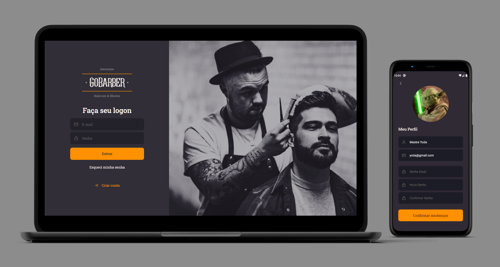

<h1 align="center">
    
</h1>

<h1 align="center">
    
</h1>

# GoBarber
This is a project developed during the Rocketseat's GoStack bootcamp. It is an application that allows appointments of barber shop services. The application allows listing of available barbers, scheduling appointments for clients and monitoring appointments for barbers. It is also possible to make new registrations and use user authentication.

## 📝 Project
A RESTfull API was used to serve the data, giving flexibility to distribute the application on multiple platforms and a SPA (Single Page Application) on the web front end to optimize performance and guarantee the best user experience.

## ⚙️ Back-end

### Technologies
- Node.js
- TypeScript
- Express
- TypeORM
- MongoDB
- PostgreSQL
- JWT
- Celebrate
- Multer
- Tsyringe
- uuidv4
- Bcrypt
- Dotenv
- Handlebars
- Nodemailer
- ESLint
- Prettier
- EditorConfig
- Date-fns
- Jest
- Arquitetura REST

## 💻 Front-end web

### Technologies
- React
- TypeScript
- React Router DOM
- Context API
- React Icons
- UnForm
- Yup
- Styled-Components
- Polished
- Axios
- ESLint
- Prettier
- EditorConfig
- Jest

## 📱 Front-end mobile

### Technologies
- React Native
- TypeScript
- UnForm
- Styled-Components
- Context API
- React Navigation
- Axios
- Yup
- ESLint
- Prettier

## 🎨 Layout
The application layout is available on the [Figma](https://www.figma.com/file/BXCihtXXh9p37lGsENV614/GoBarber).

## 🔧 Execute on your PC

- Clone this repository;
- Change to folder backend `cd backend`;
- Run the command to install the dependencies, like `npm install` or `yarn`;
- Create a PostgreSQL database with the name "gostack_gobarber";
- Update the ormconfig.json file with your database username and password;
- Run migrations with the `yarn typeorm migration:run` command;
- Start the backend running command `yarn dev:server` or `npm dev:server`, your backend will run at port 3333;
- Open new terminal on root folder and then change to folder web `cd web`;
- Run the command to install the dependencies, like `npm install` or `yarn`;
- After that, run the command to start the project, for example: `npm run dev` or `yarn start`;
- Then access the application at <strong>`http://localhost:3000`</strong>, change the port if you're using another.

## 🤔 How to Contribute

- Fork this repository;
- Create a branch with your feature: `git checkout -b my-feature`;
- Commit your changes: `git commit -m 'feat: my new feature'`;
- Push to your branch: `git push origin my-feature`.

## 📜 License

> This project is under the MIT license. See the archive [LICENSE](https://github.com/jessicafpx/gostack-gobarber/blob/master/LICENSE.md) for more details.

---

##### 
 <strong> < developed by <a href="github.com/jessicafpx"> @jessicafpx</a> /> </strong> 👋